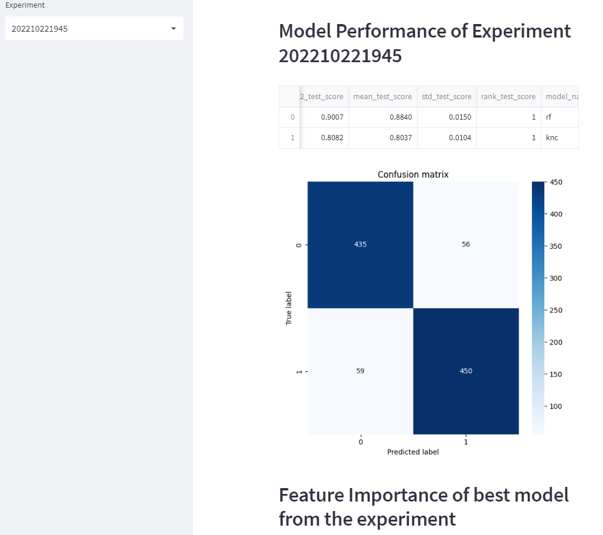

# Churn prediction using machine learning
Please read [the blog](https://canfang-feng.github.io/blog/) for more details about this project.

## Description
For many businesses, customer churns are costly and become key problems. Identifying unhappy customers earlier can give a chance for companies to take action and keep customer incentive to stay. Most companies have collected customer information. Using customer information to create a machine learning model to automate identifying unhappy customers becomes possible and highly demanded in many industries. This time, we takes a mobile phone operator as an example to create customer churn prediction. Firstly, a notebook is created and provided to analyze the customer churn situation in this mobile phone operator through visualizations and data exploration. An ETL pipeline is created to load and clean the data and an ML pipeline is designed to implement the algorithms and models, select the metrics to evaluate the performance and save the result of each experiment for tracking the ML train work.

## Dataset
The dataset here use is publicly available and was mentioned in the book [Discovering Knowledge in Data](https://www.amazon.com/dp/0470908742/) by Daniel T. Larose. It is attributed by the author to the University of California Irvine Repository of Machine Learning Datasets. The dataset is about customer churn prediction. It contains 5000 rows and 21 columns. 

## Dependencies
Requires [poetry](https://python-poetry.org/), whose installation instructions can be found [here](https://python-poetry.org/docs/#installing-with-the-official-installer). You also need to have right Python version installed through pyenv. Run `poetry install` to install all dependencies in the root directory of the project, where `poetry.lock` is located.

```
pyenv install 3.10.4
pyenv local 3.10.4
poetry env use 3.10.4
poetry install
poetry shell

```

## Run instructions:

Run the following commands in the project's **root directory** to process raw data, train and save model.

Step 1: run a pipeline `process_data.py` to load raw dataset of churn.txt, clean data, create labels, split train and test dataset, and save them to `data` folder for further ML modeling.
```
$ python process_data.py 
Reading raw data...
Cleaning raw data...
Total number of customer: 4999
Convert categorical features to numeric variables...
Total number of churned customer: 2498
Total number of features: 103
Creating train and test set...
Done! Dataset is saved as data/train.csv and data/test.csv from the current directory.
```

Step 2: run ML pipeline `train_model.py` to train classifier and save results to `experiments` folder (if not exist, it will be created). Results include model, feature importance, and model performance, prediction results on test set.
```
$ python train_model.py
202210221945
Loading processed train and test data...
Evaluation metric is: F2 score
Training models...
Fitting 3 folds for each of 1 candidates, totalling 3 fits
[CV 3/3] END ..................clf__max_depth=5;, score=0.901 total time=   0.5s
[CV 1/3] END ..................clf__max_depth=5;, score=0.864 total time=   0.5s
[CV 2/3] END ..................clf__max_depth=5;, score=0.887 total time=   0.5s
fit_model took 2.743 s
Fitting 3 folds for each of 1 candidates, totalling 3 fits
[CV 1/3] END ..............clf__weights=uniform;, score=0.789 total time=   0.1s
[CV 3/3] END ..............clf__weights=uniform;, score=0.808 total time=   0.1s
[CV 2/3] END ..............clf__weights=uniform;, score=0.814 total time=   0.1s
fit_model took 0.916 s
Best model: Pipeline(steps=[('clf', RandomForestClassifier(max_depth=5))]), score: 0.8840454346677933
saving grid search results to experiments/202210221945
saving best model to experiments/202210221945 as model.joblib
              precision    recall  f1-score   support

           0       0.87      0.91      0.89      1922
           1       0.92      0.88      0.90      2077

    accuracy                           0.89      3999
   macro avg       0.90      0.90      0.89      3999
weighted avg       0.90      0.89      0.90      3999

[[1756  254]
 [ 166 1823]]
predict_with_sklearn took 0.024 s
              precision    recall  f1-score   support

           0       0.88      0.89      0.88       491
           1       0.89      0.88      0.89       509

    accuracy                           0.89      1000
   macro avg       0.88      0.89      0.88      1000
weighted avg       0.89      0.89      0.89      1000

[[435  56]
 [ 59 450]]
Saved feature importances to experiments/202210221945
```

Step 3: Add and try different models by changing the `models` dictionary in `main` function in `train_model.py` and run the script again. Compare the results in "experiments" folder and improve the model performance.

Step 4: Run the `app.py` to open a web app to explore the model performance and prediction results. The web app is built with Streamlit and can be deployed on Heroku in future.
```
$ streamlit run app.py

Collecting usage statistics. To deactivate, set browser.gatherUsageStats to False.


  You can now view your Streamlit app in your browser.

  Network URL: XXXX:8501
  External URL: XXXX:8501
```


## Evaluate model performance
We use cross-validation to evaluate the performance of the model. The model is trained on 80% of the data and evaluated on the remaining 20%. The model is trained and evaluated 3 times, and the average performance is reported. We also use grid search to find the best hyperparameters for each model and compare each model's perforamnce. The best model is saved to `experiments` folder.

To evaluate customer churn prediction model, here select `F2 score` as the evaluation metric. Reason is that the stakes of misidentifying a False Negative (a customer was predicted would not churn but then actually did) were much more serious than predicting False Positives. So, give more weight to recall. 
Based on the evaluation metric, the best model is `HistGradientBoostingClassifier` with max_depth=5. The model performance is shown below:
```
Best model: Pipeline(steps=[('clf', HistGradientBoostingClassifier(max_depth=5))]), F2 score on test dataset: 0.9446
```
The top 5 features that contribute to customer churn are `Night Charge`, `Night Calls`, `Day Mins`, `Eve Mins`, `Eve Charge`.


## Project structure 
<pre>
.
├── data
│ ├── churn.txt               <- Raw data
│ ├── train.txt               <- train dataset for ML modeling
│ └── test.csv                <- test dataset for ML modeling
├── experiments               <- Experiment results folder
│   ├── 202210221945          <- Result of RandomForestClassifier
│   └── 202210222013          <- Result of HistGradientBoostingClassifier
├── config.py                 <- Script to set up configurations and parameters
├── process_data.py           <- Script to process raw data
├── train_model.py            <- Script to train model and save results
├── app.py                    <- Script to run streamlit web app
├── exploration.ipynb         <- Jupyter notebook for data exploration
├── poetry.lock               <- Poetry lock file for dependencies
├── pyproject.toml            <- Poetry project file for dependencies
├── .python-version          
├── .gitignore
└── README.md
 
</pre>


## Acknowledgements
Must give credit to [Discovering Knowledge in Data](https://www.amazon.com/dp/0470908742/) for the dataset.