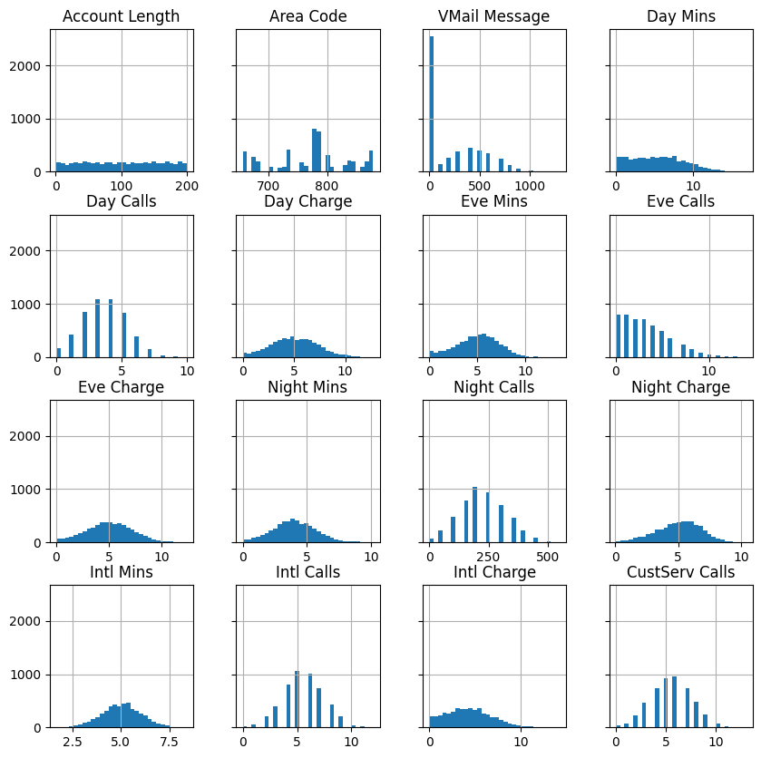
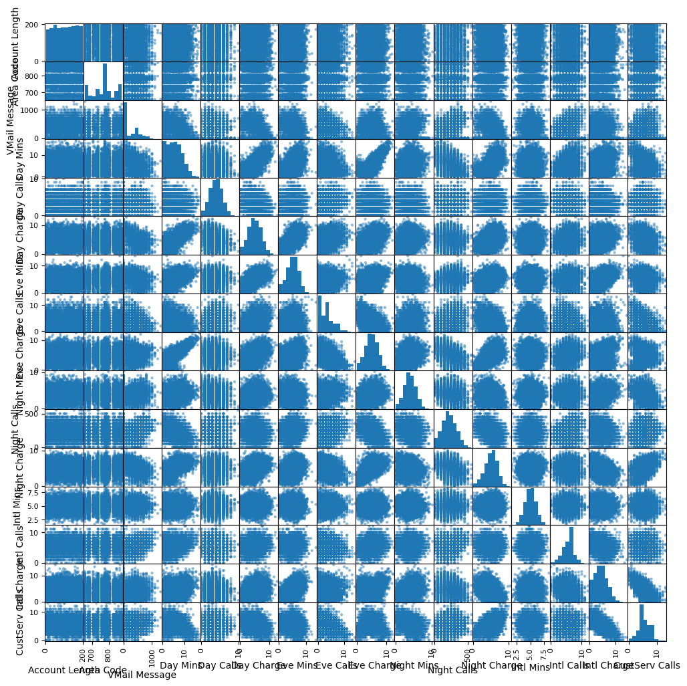
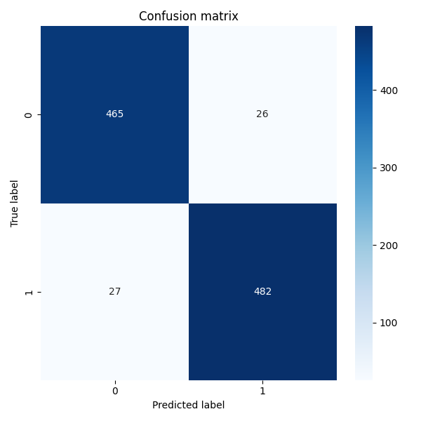
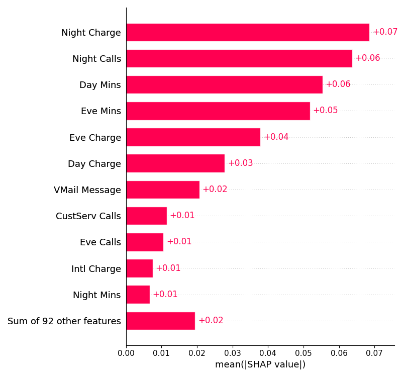

# Churn prediction using machine learning

## Background
For many businesses, customer churns are costly and become key problems. Identifying unhappy customers earlier can give a chance for companies to take action and keep customer incentive to stay. Most companies have collected customer information. Using customer information to create a machine learning model to automate identifying unhappy customers becomes possible and highly demanded in many industries. This time, we takes a mobile phone operator as an example to create customer churn prediction. The codes of project can be found in the [Github repo](https://github.com/canfang-feng/customers-churn-prediction).  

## Dataset
The dataset here use is publicly available and was mentioned in the book [Discovering Knowledge in Data](https://www.amazon.com/dp/0470908742/) by Daniel T. Larose. It is attributed by the author to the University of California Irvine Repository of Machine Learning Datasets. The dataset is about customer churn prediction. It contains 5000 rows and 21 columns. The columns are as follows:
- `State`: the US state in which the customer resides, indicated by a two-letter abbreviation; for example, OH or NJ
- `Account Length`: the number of days that this account has been active
- `Area Code`: the three-digit area code of the corresponding customer’s phone number
- `Phone`: the remaining seven-digit phone number
- `Int’l Plan`: whether the customer has an international calling plan: yes/no
- `VMail Plan`: whether the customer has a voice mail feature: yes/no
- `VMail Message`: the average number of voice mail messages per month
- `Day Mins`: the total number of calling minutes used during the day
- `Day Calls`: the total number of calls placed during the day
- `Day Charge`: the billed cost of daytime calls
- `Eve Mins, Eve Calls, Eve Charge`: the billed cost for calls placed during the evening
- `Night Mins`, `Night Calls`, `Night Charge`: the billed cost for calls placed during nighttime
- `Intl Mins`, `Intl Calls`, `Intl Charge`: the billed cost for international calls
- `CustServ Calls`: the number of calls placed to Customer Service
- `Churn?`: whether the customer left the service: true/false

The last attribute, `Churn?`, is known as the target attribute: the attribute that we want the ML model to predict. 


## Data exploration

__check missing values and data types__

We first checked the data types of each column and the number of missing values in each column. By default, the `Area Code` column is read as a numeric column. However, it is actually a categorical column. We changed the data type of `Area Code` to `category`. There are no missing values in the dataset. Nice!

__check the distribution of the target attribute__

We then checked the distribution of the target attribute. The target attribute is a binary variable. The distribution of the target attribute is balanced. The number of customers who churned is 2498, 50% of the total number of customers. This is a typical case of balanced data.

__check the distribution of each feature__

`Phone` value is unique for each customer. It is not useful for prediction. We dropped the `Phone` column. We then checked the distribution of each feature. The distribution of each feature is not balanced. Some features have a large number of unique values. For example, `State` has 51 unique values and quite evenly distributed. We will need to deal with these features later.

Most of the numeric features have a normal distribution. 



__check the correlation between features__

We then checked the correlation between features. The correlation between features is not high, we don't need to drop any features.




## Data preprocessing

__convert categorical features to numeric features__

We use pandas `get_dummies` function to convert categorical features to numeric features. The features `State`, `Area Code`, `Int’l Plan`, `VMail Plan` are converted to numeric features, and total 103 numeric features are created in the dataset for modeling.

__split the dataset into training set and test set__

We randomly split the dataset into training set and test set . The training set contains around 4000 rows and the test set contains 1000 rows. The target attribute is balanced in both training set and test set.

All the above steps are done in the `data_preprocessing.py` file if we want to run the code.
```
$ python process_data.py 
Reading raw data...
Cleaning raw data...
Total number of customer: 4999
Convert categorical features to numeric variables...
Total number of churned customer: 2498
Total number of features: 103
Creating train and test set...
Done! Dataset is saved as data/train.csv and data/test.csv from the current directory.
```

## Model training

This is a binary classification problem. There are many models we can use to solve this problem. Sklearn provides many models for classification. The following models can be used to train the dataset:
- Logistic regression
- Decision tree
- Random forest
- Gradient boosting
- Support vector machine
- K-nearest neighbors
- Neural network

So which model would be the best model for this problem? We create a good framework to try different models, do different experiments and track the performance in `train_model.py`. We basically use sklearn `Pipeline`  to find the best model and its best parameters. We can also easily add new models to the framework. The framework is as follows:

```py
    models = {
        "rf": {
            "classifier": ("clf", RandomForestClassifier()),
            "params": {
                "clf__max_depth": [5],
            },
        },
        "gb": {
            "classifier": ("clf", HistGradientBoostingClassifier(scoring=scorer)),
            "params": {
                "clf__max_depth": [5],
            },
        },
        "knc": {
            "classifier": ("clf", KNeighborsClassifier()),
            "params": {
                "clf__weights": ["uniform"],
            },
        },
    }
```

## Model evaluation

We use cross-validation to evaluate the performance of the model. The model is trained on 80% of the data and evaluated on the remaining 20%. The model is trained and evaluated 3 times, and the average performance is reported. We also use `GridSearchCV` to find the best hyperparameters for each model and compare each model's perforamnce. The best model is saved to `experiments` folder.

To evaluate customer churn prediction model, here select `F2 score` as the evaluation metric. Reason is that the stakes of misidentifying a False Negative (a customer was predicted would not churn but then actually did) were much more serious than predicting False Positives. So, give more weight to recall. 

## Model performance

Currently, we have 3 models in the framework: Random Forest, Gradient Boosting and K-nearest neighbors. Based on the evaluation metric, the best model is `HistGradientBoostingClassifier` with max_depth=5. The model performance is shown below:
```
Best model: Pipeline(steps=[('clf', HistGradientBoostingClassifier(max_depth=5))]), F2 score on test dataset: 0.9446
```
The confusion matrix of the best model is shown below:




## Feature importance

Which features are important for customer churn prediction? We can use the `feature_importances_` attribute of the model to get the feature importance. Automatically, the feature importance is normalized to sum up to 1. The feature importance of the Random Forest classifier is shown below:

	    features	importances
    0	Night Charge	0.182514
    1	Night Calls	0.166075
    2	Day Mins	0.157481
    3	Eve Mins	0.125830
    4	Eve Charge	0.105278
    5	Day Charge	0.065011
    6	VMail Message	0.048135
    7	CustServ Calls	0.041358
    8	Night Mins	0.021953
    9	Eve Calls	0.020309
    ...

We can use shap to visualize the feature importance. 


The feature importance is shown below:
The top 5 features that contribute to customer churn are `Night Charge`, `Night Calls`, `Day Mins`, `Eve Mins`, `Eve Charge`.

## Conclusion

In this project, we built a customer churn prediction model using the telecom churn dataset. We used sklearn `Pipeline` to create a framework to train different models and find the best model. We used `GridSearchCV` to find the best hyperparameters for each model. We used `F2 score` as the evaluation metric. The best model is `HistGradientBoostingClassifier` with max_depth=5. We also used shap to visualize the feature importance. In the repos, we also have a `app.py` file to create a simple web app to track the experiment results and explore the model training process and performance. Please check the repos for more details.
